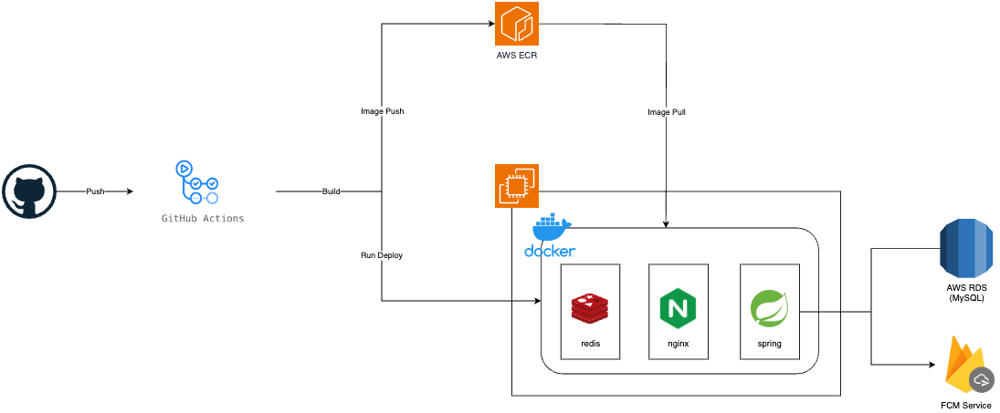

# PPAP (Pnu Post Alarm Project)
부산대학교 학과 게시판의 공지사항을 알림으로 받아보고 한눈에 모아볼 수 있는 서비스입니다.

## Introduction of PPAP
### 🤔 Why?
> 부산대학교 학생들은 졸업, 장학, 수업 등 중요한 정보를 얻기 위해 학과 게시판을 주로 이용합니다.
>
> 하지만 언제 중요한 공지사항이 등록될지 모르다 보니 종종 놓치는 경우도 있습니다.
> 
> 또한 졸업과제, 채용, 경진 게시판 등 하나의 학과라도 여러 개의 게시판이 따로 흩어져서 접속하는데 번거로움이 있었습니다.

**PPAP는 다음과 같은 두 가지 욕구를 만족하기 위해 탄생했습니다. 🥳**
- 중요 공지사항을 빠르게 알림으로 받아보고 싶다.
- 여러 게시판의 공지사항을 한 눈에 모아보고 싶다.

### ☺️ 팀원
|   [김태호](https://github.com/Train0303)  |   [남원정](https://github.com/1jeongg)     |
|:----------------------------------------------:|:----------------------------------------------:|
|   |   |  
| `Backend`, `PM` |  `Android`, `Design` |

## 구성도

## 주요 기능
- API Server
  - 회원, 구독, 공지사항, 스크랩 API 제공
- Batch Program
  - 30분 단위로 공지사항을 읽어 새로운 공지사항이 있을 시 앱 푸시알림 서비스 제공
  - 매일 밤을 기준으로 엑셀 파일(공지사항 링크)을 읽어 갱신 사항 존재시 DB에 반영

## 개발
### 📖 Libraries
- java : JDK17
  - jsoup
  - firebaseSDK
  - json-simple
  - java-jwt
  - jdom
- spring-boot : 3.12
  - web-mvc
  - data-jpa
  - data-redis
  - logging
  - mail
  - security
  - validation
  - batch
